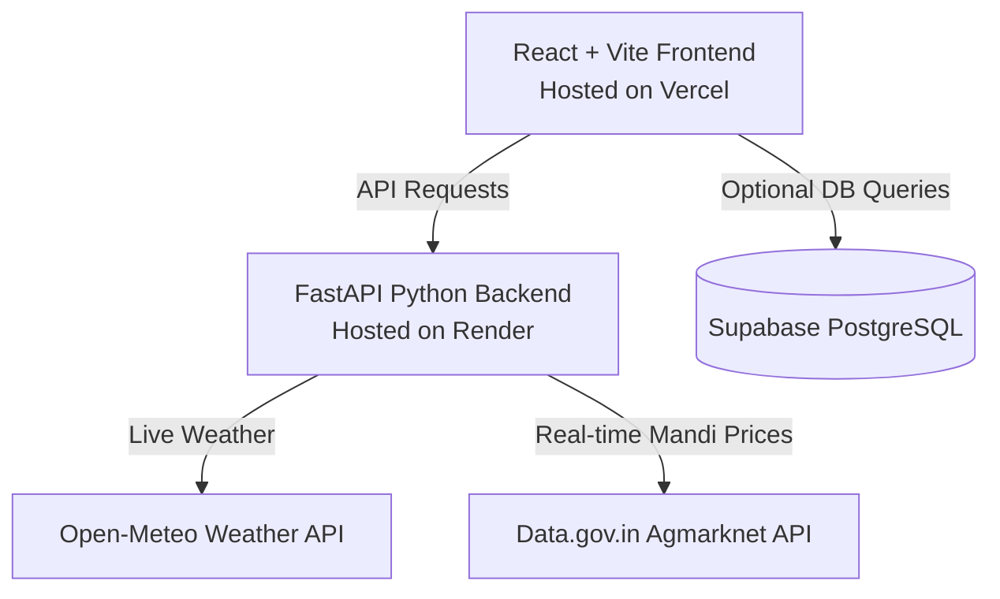

# 🚀 Production Deployment Guide: Market Price Intelligence & MSP Recommender

This guide details how to take the **Market Price Intelligence & MSP Recommender (College Competition Platform / CCP Project)** from local development to production.

The application has a decoupled architecture:
* **Frontend**: React + Vite + Tailwind SPA
* **Backend**: Python FastAPI ML API
* **Database**: Supabase (PostgreSQL)

---

## 🏗️ Production Architecture

---

## 1️⃣ Database Setup (Supabase)

The project includes `supabase_schema.sql` which defines database tables for government MSP rates, market prices, and user profiles.

1. **Create a Supabase Project**:
   * Go to [supabase.com](https://supabase.com) and sign in.
   * Click **New Project** and select your organization and region.
2. **Execute Schema SQL**:
   * Go to the **SQL Editor** in the left navigation panel.
   * Click **New Query**.
   * Copy the entire contents of **[supabase_schema.sql](file:///e:/CCP/supabase_schema.sql)** and paste it into the editor.
   * Click **Run**. This will create the `msp_rates`, `market_prices`, and `user_profiles` tables and seed default MSP prices for 2025.

---

## 2️⃣ Backend Deployment (FastAPI on Render)

Render is an excellent platform for deploying FastAPI services. The backend runs inside the `backend` subdirectory.

### 📋 Prerequisites
We have automatically created **[backend/requirements.txt](file:///e:/CCP/backend/requirements.txt)** in your repository to handle all libraries.

### 🚀 Step-by-Step Setup
1. **Sign in to Render**: Go to [render.com](https://render.com) and log in using GitHub.
2. **Create Web Service**:
   * Click **New +** -> **Web Service**.
   * Connect your GitHub repository.
3. **Configure Settings**:
   * **Name**: `agri-price-backend` (or similar)
   * **Root Directory**: `backend` *(CRITICAL: Tell Render to run from the backend directory)*
   * **Runtime**: `Python 3`
   * **Build Command**: `pip install -r requirements.txt`
   * **Start Command**: `uvicorn app.main:app --host 0.0.0.0 --port $PORT`
   * **Instance Type**: Select **Free**
4. **Environment Variables**:
   Click **Advanced** -> **Add Environment Variable** and add:
   
   | Variable | Value | Description |
   | :--- | :--- | :--- |
   | `SUPABASE_URL` | `https://your-project.supabase.co` | Your Supabase Project URL |
   | `SUPABASE_KEY` | `sb_secret_...` | Supabase Service Role Key (secret key) |
   | `DATA_GOV_IN_API_KEY` | *(Optional)* | Your API Key from data.gov.in (defaults to `demo` synthetic fallback if omitted) |

5. **Deploy**: Click **Create Web Service**. Wait for the build to complete and show "Your service is live!".
6. **Note the Live URL**: Copy the URL generated by Render (e.g. `https://agri-price-backend.onrender.com`).

---

## 3️⃣ Frontend Deployment (React on Vercel)

Vercel is the premier platform for deploying React/Vite SPAs. The frontend runs inside the `frontend` subdirectory.

### 📋 Prerequisites
* We have created **[frontend/vercel.json](file:///e:/CCP/frontend/vercel.json)** in your repository to configure single-page application routing rewrites.
* We have refactored the frontend to use a central config file **[frontend/src/config.js](file:///e:/CCP/frontend/src/config.js)** so it dynamically reads the API server URL.

### 🚀 Step-by-Step Setup
1. **Sign in to Vercel**: Go to [vercel.com](https://vercel.com).
2. **Import Project**:
   * Click **Add New** -> **Project**.
   * Select your GitHub repository.
3. **Configure Project**:
   * **Framework Preset**: `Vite` (automatically detected)
   * **Root Directory**: Click **Edit** and select `frontend` *(CRITICAL: Vercel must build inside the frontend folder)*
   * **Build and Output Settings**: Default is fine (`npm run build` and `dist`)
4. **Environment Variables**:
   Expand the **Environment Variables** section and add:

   | Variable | Value | Description |
   | :--- | :--- | :--- |
   | `VITE_API_URL` | `https://agri-price-backend.onrender.com` | **Your Deployed Render Backend URL** (NO trailing slash `/`) |
   | `VITE_SUPABASE_URL` | `https://your-project.supabase.co` | Your Supabase Project URL |
   | `VITE_SUPABASE_PUBLISHABLE_DEFAULT_KEY` | `sb_publishable_...` | Your Supabase Anon Key |

5. **Deploy**: Click **Deploy**. Vercel will build and publish your Vite application.
6. **Note the Live URL**: You will get a URL like `https://agri-price-frontend.vercel.app`.

---

## 🛠️ Verification Checklist

Once both services are deployed, perform these quick tests:

- [ ] **Load Application**: Navigate to the Vercel URL. Verify the dashboard renders beautifully.
- [ ] **Routing Test**: Switch between **Plan**, **Grow**, and **Sell** stages, then refresh the page. Deep routing should load seamlessly without 404 errors (verifies `vercel.json` routing rules).
- [ ] **Location & Mandi Selection**: Select different mandis. Verify that the crops list updates dynamically (verifies `/crops/recommended` API endpoint).
- [ ] **Live Weather & Crop Risk**: Go to the **Grow** tab and check if weather details and advisory risk calculations load correctly (verifies `/grow` API endpoint connected to Open-Meteo).
- [ ] **Price Forecasting (ML)**: Go to the **Sell** tab. Verify the price chart displays historical/predicted prices and recommendation card shows action advice (verifies Random Forest model predictions via `/predict` and `/recommend` API endpoints).
